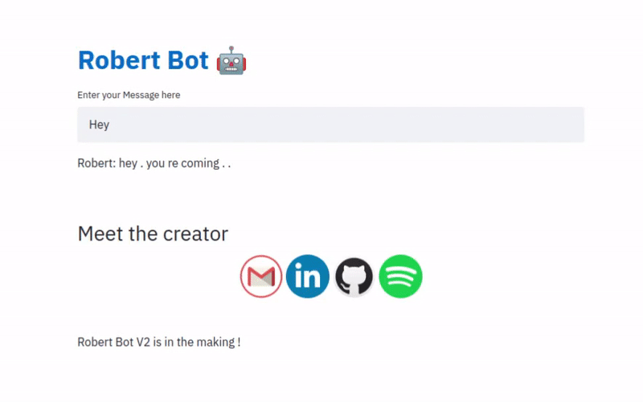

# robert_bot

### [Try a live demo online](https://robert-the-bot.herokuapp.com/)
### Or set it up locally
<!--
1. Downlaod pretrained weights from [here](https://yadi.sk/d/R9TfLSq8Tlv3-g)
-->
1. Install requirements.txt with 
```python
pip3 install -r requirements.txt
```
2. run main.py with
```python
python3 main.py
```
